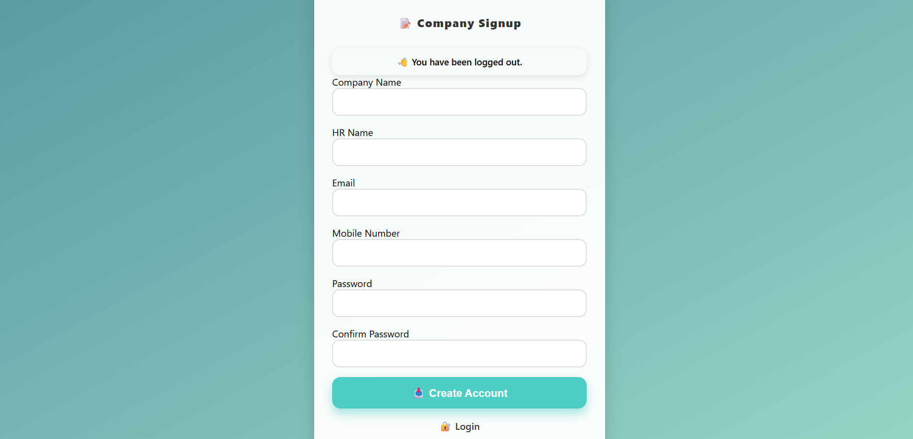
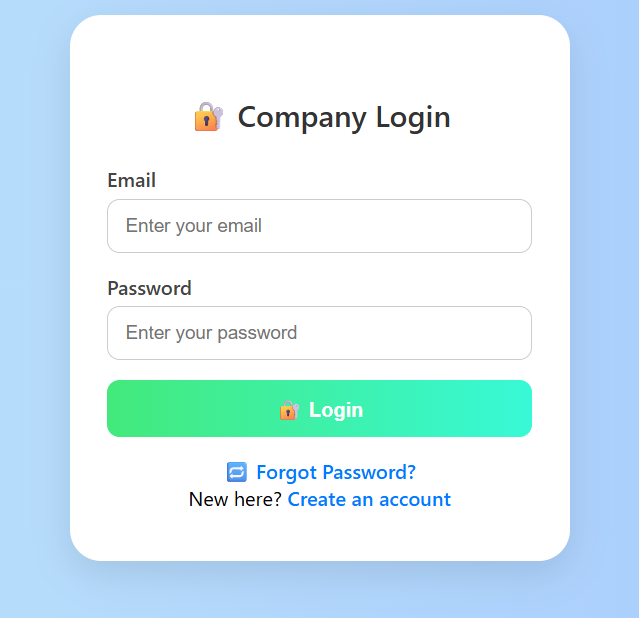
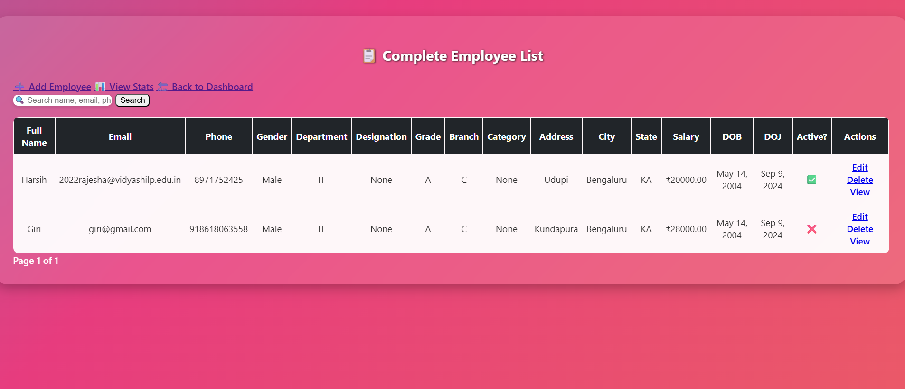
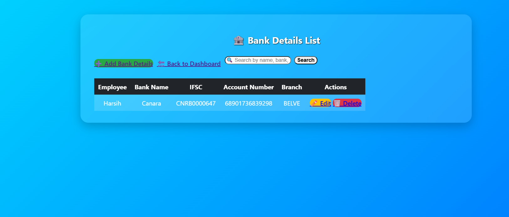
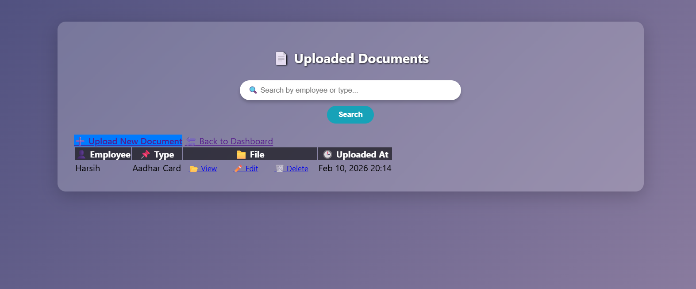
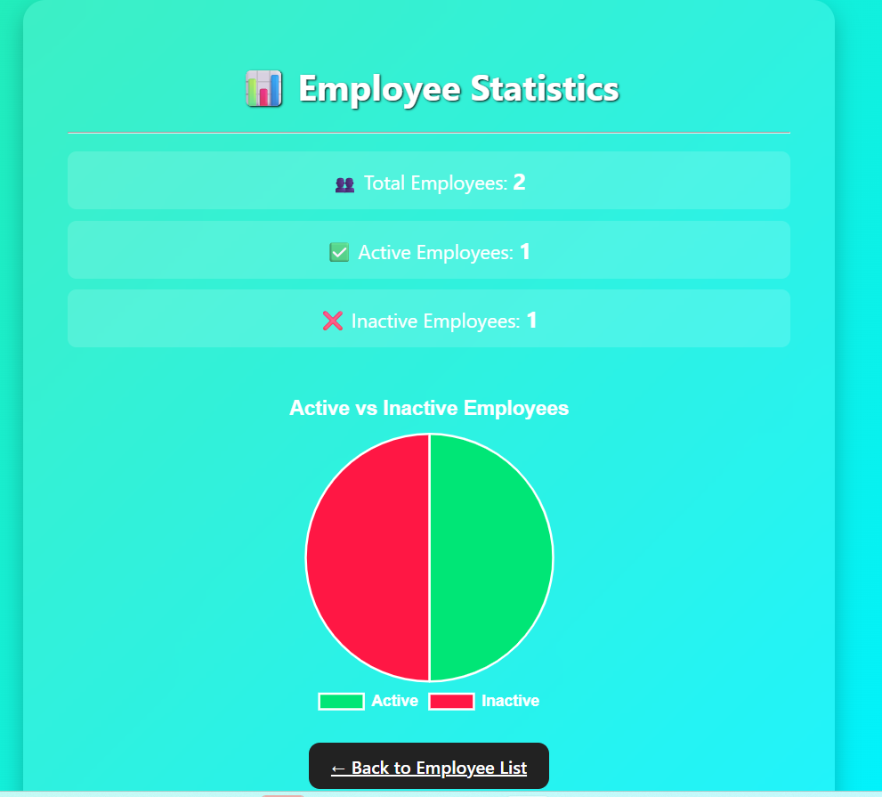
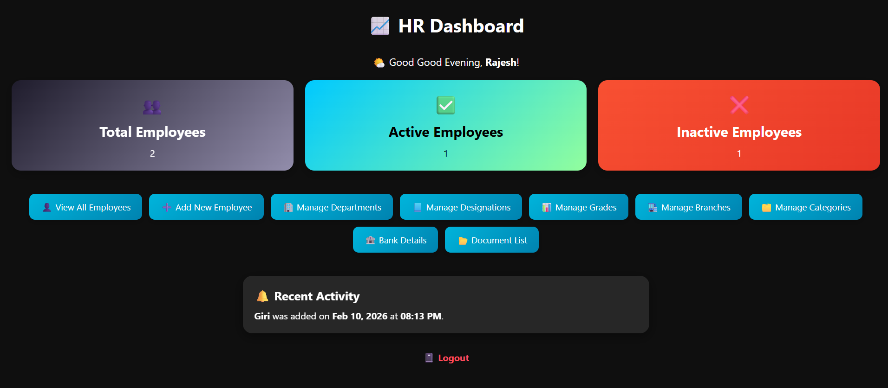

# 🧑‍💼 Mini HR Management System

A full-stack Human Resource Management System (HRMS) built using Django to manage employee records, organizational structure, banking details, document uploads, and real-time workforce statistics through an interactive dashboard.

---

## 📌 Project Overview

The Mini HR Management System digitizes and streamlines HR operations within an organization. It replaces manual record-keeping with a secure and scalable web-based solution that enables efficient management of employees and administrative data.

This project demonstrates real-world backend development using Django, including authentication, database modeling, CRUD operations, file handling, and dashboard analytics.

---

## 🚀 Features

### 🔐 Authentication System

- Company Signup  
- Secure Login & Logout  
- Password hashing  
- Session-based authentication  
- Protected routes  

---

## 📝 Signup Page



---

## 🔑 Login Page



---

## 👥 Employee Management

- Add new employees  
- View employee list  
- Edit and update employee records  
- Delete employee records  
- Track Active / Inactive status  
- Search functionality  

---

## 📋 Employee List



---

## 🏦 Bank Details Module

- Store IFSC, Account Number, Branch  
- Edit and delete banking records  

---

## 🏦 Bank Details Page



---

## 📁 Document Management

- Upload employee documents  
- Manage uploaded files  
- Search by employee or document type  

---

## 📂 Document Page



---

## 📊 Dashboard & Statistics

- Total Employees count  
- Active Employees count  
- Inactive Employees count  
- Pie chart visualization  
- Recent activity tracking  

---

## 📊 Statistics Page



---

## 📈 HR Dashboard



---

## 🛠️ Tech Stack

| Technology | Purpose |
|------------|----------|
| Python | Backend programming |
| Django | Web framework |
| SQLite | Database |
| HTML5 | Structure |
| CSS3 | Styling |
| JavaScript | Frontend interaction |
| Chart.js | Data visualization |

---

## 🏗️ Project Structure

```
mini_hr/
│
├── authentication/
├── employee/
├── bank/
├── document/
├── master/
├── mini_hr/
├── static/
├── screenshots/
│
├── manage.py
├── requirements.txt
└── README.md
```


---

## ⚙️ Installation & Setup

```bash
git clone https://github.com/Rajesh-poojary053/mini_hr.git
cd mini_hr
python -m venv st_env
st_env\Scripts\activate
pip install -r requirements.txt
python manage.py makemigrations
python manage.py migrate
python manage.py runserver
```
Open in browser:
http://127.0.0.1:8000/

🔐 Security Features

CSRF protection

Django authentication system

Secure password hashing

Session-based access control

Form validation

🎯 Future Improvements

Role-based access control

Payroll integration

Leave management module

REST API implementation

Cloud deployment (Render / AWS)


📌 Repository Description

Django-based HR Management System for managing employees, organizational structure, banking details, documents, and workforce statistics.


